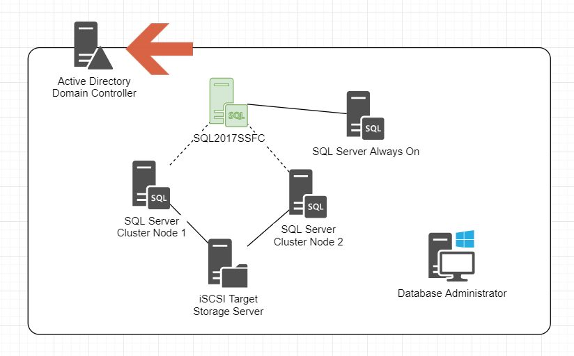
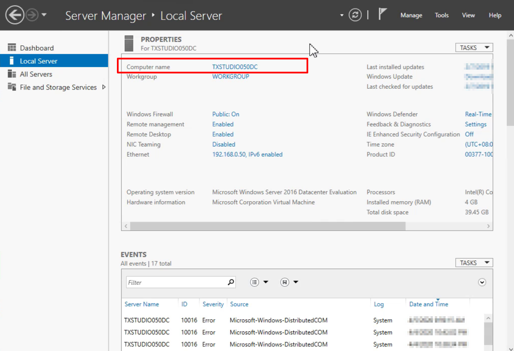
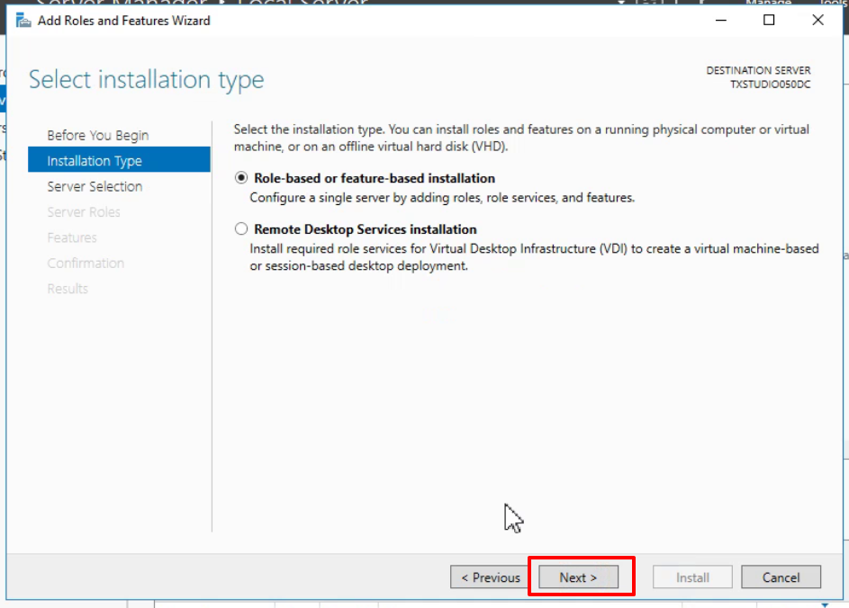
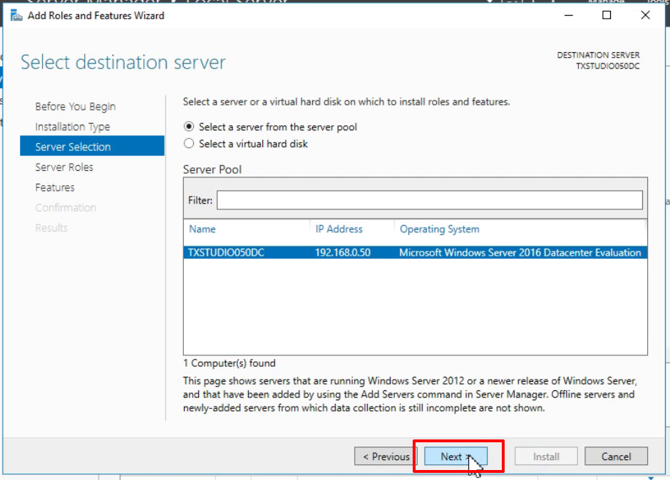
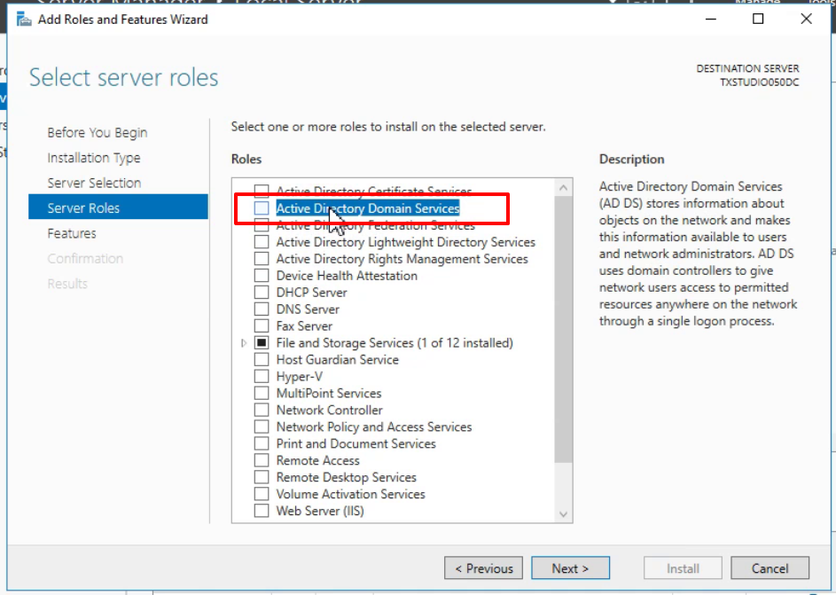
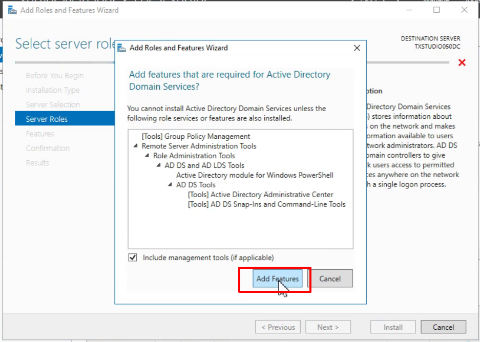
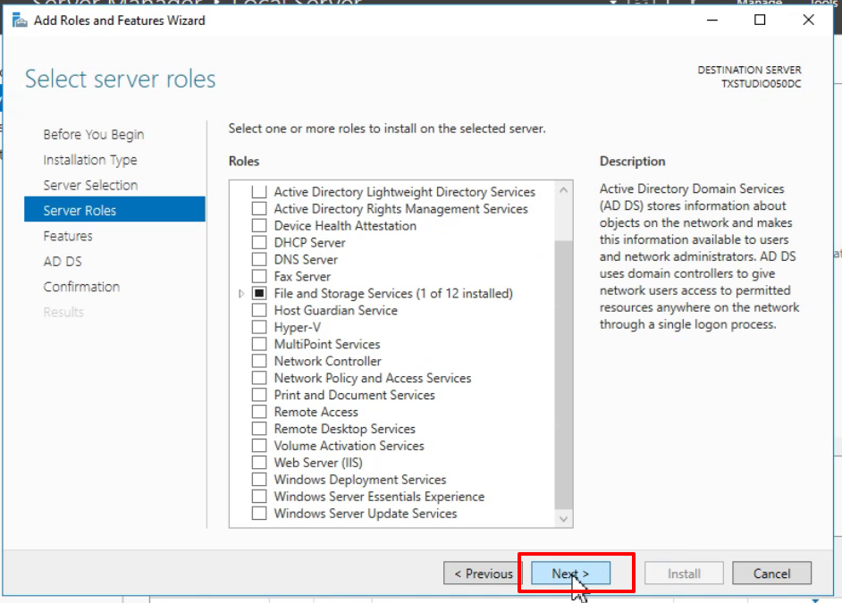
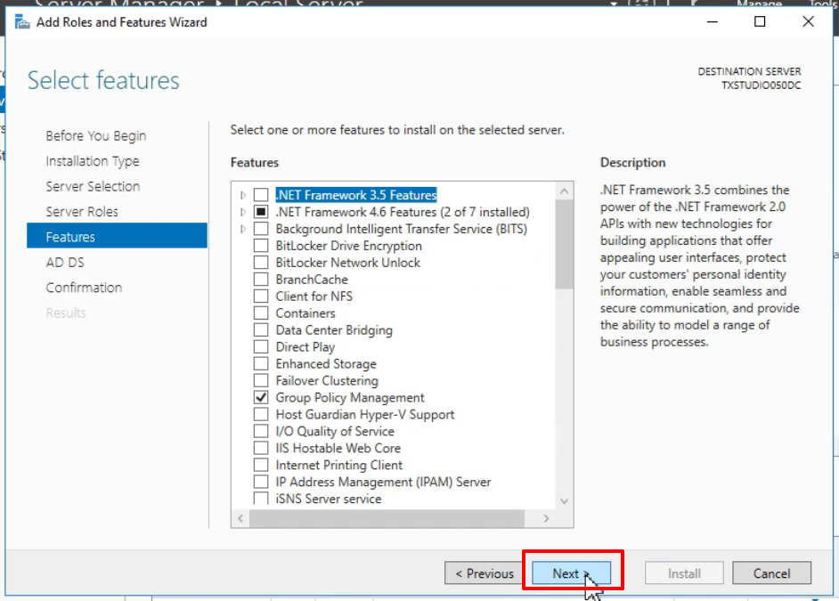
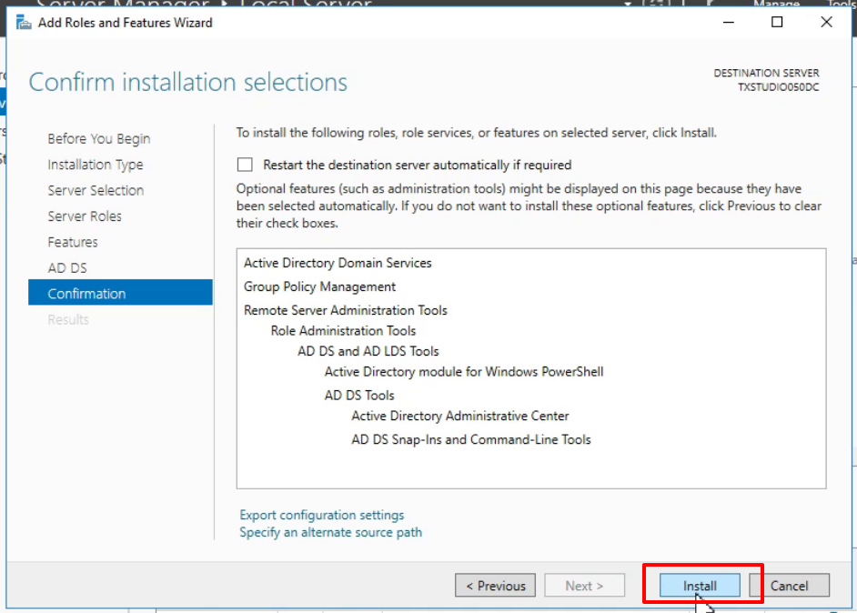
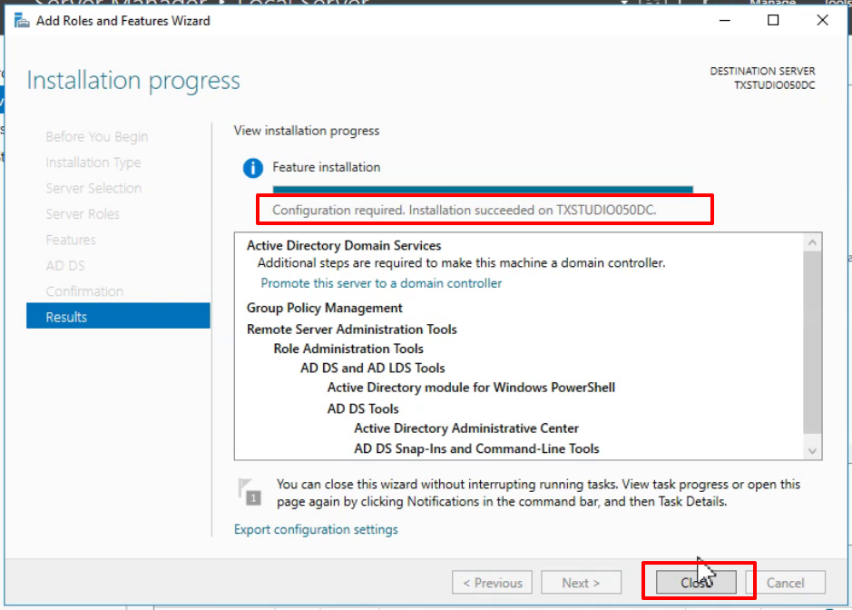

# 安裝網域服務

項目都規劃完成後

首先要準備 Active Directory 網域控制站 (Domain Controller) 讓其他電腦加入網域服務

根據先前規劃

安裝的電腦名稱為 TXSTUDIO050DC (192.168.0.50)

## 安裝網域服務 (Active Directory Domain Service)

前往 TXSTUDIO050DC 電腦

在 Server Manager 的 Manage 點選 Add Roles and Features

點選 Next

選擇 Role-based or feature-based installation

預設是將功能安裝在本機

Server Roles 勾選 Active Directory Domain Service

點選 Add Features 安裝必要服務

點選 Next

Features 不需要勾選任何項目

點選 Install 開始安裝

安裝完成，並提示此項目需要進行設定

## 下一步

角色安裝完成後，就來將此電腦升級成為網域控制站

