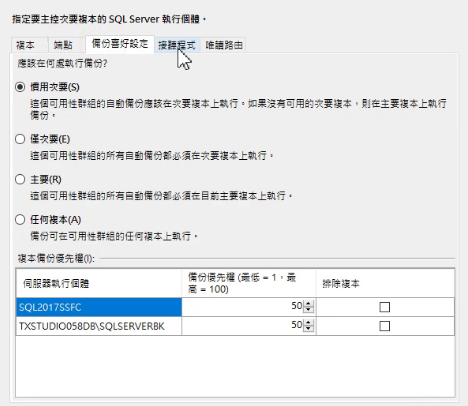

# 進行 SQL Server Always On Availability Group 設定

經過一長串的前置作業後

終於要在此步驟開始設定 SQL Server Always On Availability Group

## 設定 Always On 高可用性群組

前往 TXSTUDIO059WG 進入 SQL Server Management Studio 並連線至 SQL2017SSFC 資料庫

在「Always On 高可用性」下的「可用性群組」點選右鍵開啟「新增可用性群組精靈」

輸入可用性群組名稱

勾選 AdventureWorks2017 資料庫

點選「加入複本」

使用 Windows 驗證連線至 TXSTUDIO058DB 資料庫

「可讀取次要」勾選為「是」，設定完成後才可以驗證

其它設定就預設即可

點選「下一步」繼續

選擇「完整的資料庫及紀錄備份」並輸入先前備份儲存的檔案共用 UNC 路徑

驗證通過後點選「下一步」

點選「完成」就會開始設定

設定完畢

此時連線至 TXSTUDIO058DB 資料庫

AdventureWorks2017 處於正在還原狀態

在可用性資料庫點選右鍵加入可用性群組

重新將資料庫加入可用性群組

AdventureWorks2017 出現綠色小圖示代表有在同步處理

開啟 AdventureWorks2017 資料庫後可以看到資料表都被同步成功了

## 下一步

設定完成後就要來進行 AdventureWorks2017 資料同步的驗證
